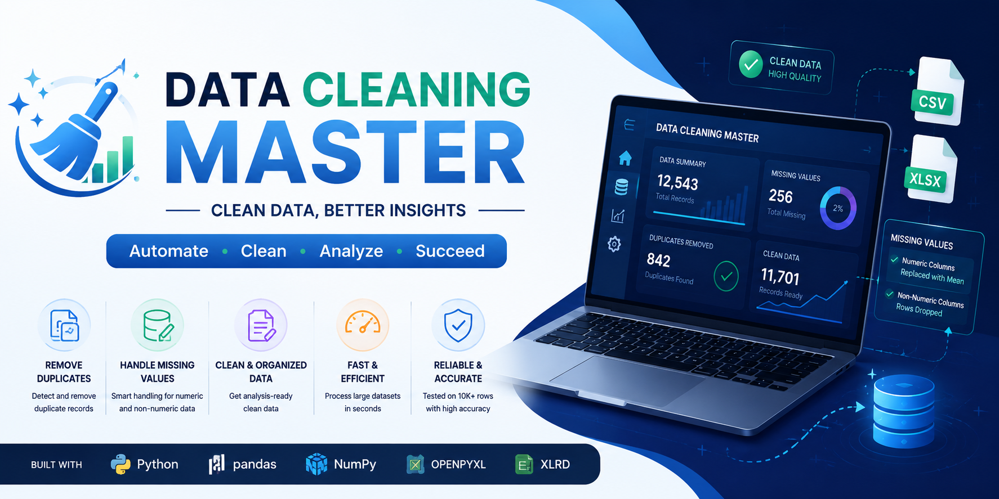

# Data Cleaning Master - Python Application

## Project Overview

Data Cleaning Master is a Python-based application designed to automate the data cleaning process for CSV and Excel datasets. The application efficiently handles duplicate records, missing values, and dataset validation, producing a clean and analysis-ready dataset within seconds.

The tool is designed to simplify data preprocessing tasks that are commonly required in Data Analytics, Data Science, and Machine Learning projects. By automating repetitive cleaning operations, it helps improve productivity and ensures data quality before analysis.

The application has been tested on multiple datasets of varying sizes and performs efficiently even on datasets containing thousands of records.

---

# Objectives

The primary objectives of this project are:

* Load datasets from CSV and Excel files.
* Validate dataset paths and file formats.
* Detect and remove duplicate records.
* Create a backup of duplicate records before deletion.
* Handle missing values automatically.
* Replace missing values in numeric columns using the column mean.
* Remove rows containing missing values in non-numeric columns.
* Generate a cleaned dataset ready for analysis.
* Improve efficiency in data preprocessing workflows.

---

# Project Requirements

The following libraries and tools are required:

* Python 3.x
* Pandas
* NumPy
* OpenPyXL
* XLRD
* OS Library

Install dependencies using:

```bash
pip install pandas numpy openpyxl xlrd
```

---

# Step-by-Step Process

## 1. User Input and Dataset Validation

The application begins by asking the user to provide:

* Dataset path
* Dataset name

The system verifies:

* Whether the file exists
* Whether the file format is supported
* Supported formats:

  * CSV (.csv)
  * Excel (.xlsx)

---

## 2. Duplicate Detection and Removal

The application scans the dataset for duplicate records.

If duplicate records are found:

* A backup file is created.
* Duplicate records are stored separately.
* Duplicate rows are removed from the main dataset.

Output file:

```text
dataset_name_duplicates.csv
```

---

## 3. Missing Value Analysis

The application checks every column for missing values.

For Numeric Columns:

* Missing values are replaced with the column mean.

Example:

```text
Age = [20, 25, NaN, 35]

Mean = 26.67

Updated Age = [20, 25, 26.67, 35]
```

For Non-Numeric Columns:

* Rows containing missing values are removed.

This ensures that categorical data remains accurate and consistent.

---

## 4. Clean Dataset Generation

After processing:

* Duplicate records are removed.
* Missing values are handled.
* The cleaned dataset is generated.

Output file:

```text
dataset_name_Clean_data.csv
```

The user receives a confirmation message indicating successful completion.

---

## 5. Performance Testing

The application was tested on multiple datasets containing thousands of records.

Testing Results:

* Successfully processed datasets with 10,000+ rows.
* Generated clean datasets within seconds.
* No data corruption observed.
* Consistent performance across CSV and Excel formats.

The application was also tested using Jupyter Notebook and standard Python environments.

---

# Key Features

### Fast Processing

Efficiently cleans large datasets within seconds.

### Duplicate Backup

Stores duplicate records separately before deletion.

### Automated Missing Value Handling

* Numeric values → Mean Imputation
* Non-numeric values → Row Removal

### User-Friendly Interface

Simple prompts guide users through the cleaning process.

### Multi-Format Support

Supports:

* CSV Files
* Excel Files

### Analysis-Ready Output

Produces datasets that can be directly used for:

* Data Analysis
* Dashboarding
* Machine Learning
* Business Intelligence Projects

---

# Project Workflow

```text
Load Dataset
      │
      ▼
Validate File
      │
      ▼
Detect Duplicates
      │
      ▼
Save Duplicate Records
      │
      ▼
Remove Duplicates
      │
      ▼
Check Missing Values
      │
      ▼
Handle Missing Values
      │
      ▼
Generate Clean Dataset
      │
      ▼
Save Output Files
```

---

# Usage

Run the application:

```bash
python data_cleaning_master.py
```

Example:

```text
Welcome to Data Cleaning Master!

Please enter dataset path:
C:/Datasets/sales.xlsx

Please enter dataset name:
sales_data
```

Expected Output:

```text
Duplicate records saved as:
sales_data_duplicates.csv

Cleaned data saved as:
sales_data_Clean_data.csv

Data Cleaning Completed Successfully.
```

---

# Applications

This project can be used for:

* Data Analytics Projects
* Data Science Workflows
* Machine Learning Data Preparation
* Business Intelligence Reporting
* ETL Processes
* Academic Research Projects


---

# Skills Demonstrated

This project demonstrates practical knowledge of:

* Python Programming
* Pandas
* Data Cleaning
* Data Preprocessing
* File Handling
* Data Quality Management
* ETL Concepts
* Problem Solving

---

# Author

**Varun Gupta**

Aspiring Data Scientist with expertise in:

* Python
* SQL
* Power BI
* Excel
* Data Analysis
* Data Science

Passionate about transforming raw data into meaningful insights and building practical data-driven solutions.

---

# Final Thoughts

Data Cleaning Master is a practical and efficient solution for automating one of the most important stages of the data analytics lifecycle—data preprocessing. By handling duplicates, missing values, and dataset validation automatically, the application significantly reduces manual effort and improves data quality.

This project serves as a strong foundation for future enhancements and demonstrates real-world data engineering and data science skills.
